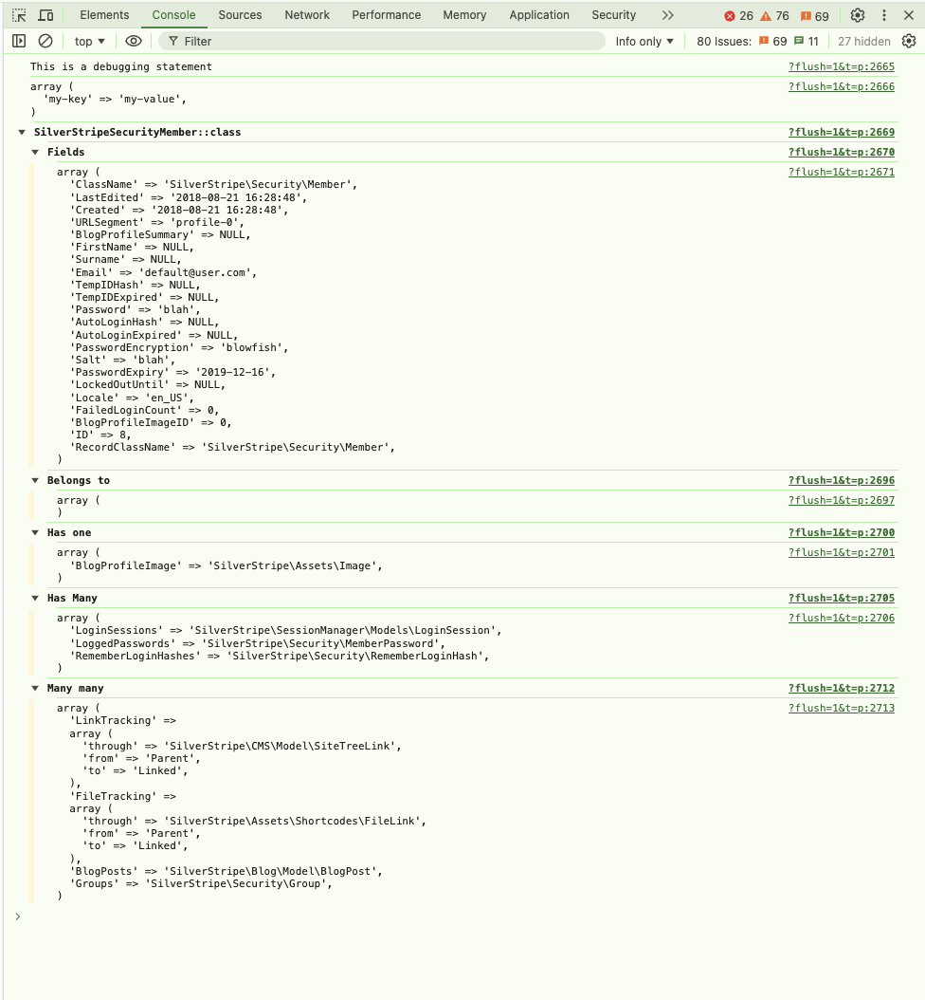

# Silverstripe Consoler

Print debug statements from your backend to your browser console.

## Installation

```sh
composer require silverstripe-consoler
```

## Documentation

```php
// Print strings
\Clie\Consoler::log('This is a debugging statement');

// Print Arrays
\Clie\Consoler::log([ "my-key" => "my-value"]);

// Print DataObjects
\Clie\Consoler::log(Member::get()->first());
```



